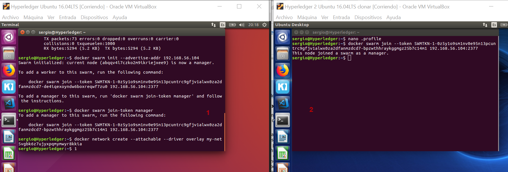

Explicacion de todos los pasos necesarios para realizar la conexion de red entre nodos para utilizar hyperledger en multiples organizaciones

# ¿Que encontramos en este documento?
- [Configuración previa en máquinas virtuales](#id1)
- [Instalación de herramientas necesaias](#id2)
- [Configuración de Docker para uso en red](#id3)
- [Explicacion de como conectar varios nodos entre si](#id4)
- [Generar elementos de seguridad](#id5)
- [Levantar la red en los dos equipos](#id6)
- [Herramientas de red (scripts fabric-samples)](#id7)

Configuración de las máquinas virtuales
------------------------------------------
1. Creamos un adaptador de red nuevo en cada máquina para crear un red aislada.
2. Creamos una carpeta compartida con nuestro equipo para poder transferir los archivos necesarios.
3. Damos persmisos a la carpeta
>sudo usermod -a -G vboxsf [username]

Instalación de herramientas necesaias
---------------------------------------
1. Instalacion de herramientas
Descargamos los "fabric samples", el comando descarga el scrip de la web: https://raw.githubusercontent.com/hyperledger/fabric/master/scripts/bootstrap.sh

>curl -sSL https://goo.gl/6wtTN5 | bash -s 1.1.0 
Nos crea un carpeta "fabric-samples"

Añadimos el directorio para poder ejecutar los scripts desde cualquier lugar del sistema

Actualizamos la lista de PATH
>PATH=$PATH:$HOME/fabric-dev-servers/fabric-samples/bin/

Configuración de Docker para uso en Red  
-----------------------------------------
_PC1_: iniciamos el swarm. Este equipo se convierte en leader
>docker swarm init --advertise-addr 192.168.56.101

Iniciamos la nueva red para ese swarm
>docker network create --attachable --driver overlay my-net

Para obtener el token que usaremos para añadir el otro equipo a este swaarm
>docker swarm join-token manager

Copiamos la informacion que nos devuelve para introducir en el otro equipo.

Si queremos dejar de ser manager del swarm
>docker swarm leave --force

En el _PC2_
>docker swarm join --token SWMTKN-1-0z5y1o9sm1nv0e95n13pcuntrc9gfjv1alwx0za2dfanmzdcd7-bpzwthhraykggmgz25b7c14m1 192.168.56.104:2377

Generar Elementos de Seguridad 
---------------------------------------------------
Descargamos el repositorio
>git clone https://github.com/wahabjawed/Build-Multi-Host-Network-Hyperledger.git

>cd Build-Multi-Host-Network-Hyperledger
>./bmhn.sh

Se crean dos carpetas:
- crypto-config
- channel-artifacts

Copiaremos estas carpetas en el *PC2*

Levantamos la red 
---------------------------------------
En el PC1 levantamos los siguientes elementos en este orden:
- El Servidor de CA
- El Orderer
- CouchDB para el Peer0
- Y el Peer0

En el PC2 levantamos los siguiente elementos en este orden:
- CouchDB para el Peer1
- El Peer1

Hay que tener en cuenta que el servidor de CA y el Orderer son comunes para esta red

---PC1---
1. Levantar CA
Nos posicionamos en el directorio “Build-Multi-Host-Network-Hyperledger"

En el fichero “‘/crypto-config/peerOrganizations/org1.example.com/ca/’” está el fichero “*.pem” con la “secret key”
Esta “secrect key” es la clave que securiza nuestra CA que tenemos que copiar para escribir en el siguiente comando.

>docker run --rm -it --network="my-net" --name ca.example.com -p 7054:7054 -e FABRIC_CA_HOME=/etc/hyperledger/fabric-ca-server -e FABRIC_CA_SERVER_CA_NAME=ca.example.com -e FABRIC_CA_SERVER_CA_CERTFILE=/etc/hyperledger/fabric-ca-server-config/ca.org1.example.com-cert.pem -e FABRIC_CA_SERVER_CA_KEYFILE=/etc/hyperledger/fabric-ca-server-config/{4b34ddbcd4d921a9d4caa2db2c68a286c743de295f4153d4c732a056b74ad4f6_sk} -v $(pwd)/crypto-config/peerOrganizations/org1.example.com/ca/:/etc/hyperledger/fabric-ca-server-config -e CORE_VM_DOCKER_HOSTCONFIG_NETWORKMODE=hyp-net hyperledger/fabric-ca sh -c 'fabric-ca-server start -b admin:adminpw -d'

La secret key hay que escribirla en el apartado que hay entre corchetes.

2. Levantar el Orderer

>docker run --rm -it --network="my-net" --name ca.example.com -p 7054:7054 -e FABRIC_CA_HOME=/etc/hyperledger/fabric-ca-server -e FABRIC_CA_SERVER_CA_NAME=ca.example.com -e FABRIC_CA_SERVER_CA_CERTFILE=/etc/hyperledger/fabric-ca-server-config/ca.org1.example.com-cert.pem -e FABRIC_CA_SERVER_CA_KEYFILE=/etc/hyperledger/fabric-ca-server-config/{put the name of secret key} -v $(pwd)/crypto-config/peerOrganizations/org1.example.com/ca/:/etc/hyperledger/fabric-ca-server-config -e CORE_VM_DOCKER_HOSTCONFIG_NETWORKMODE=hyp-net hyperledger/fabric-ca sh -c 'fabric-ca-server start -b admin:adminpw -d'

Escribir el nombre de la secrete key en el apartado que hay entre corchetes

3. Levantando el CouchDB del Peer0
>docker run --rm -it --network="my-net" --name couchdb0 -p 5984:5984 -e COUCHDB_USER= -e COUCHDB_PASSWORD= -e CORE_VM_DOCKER_HOSTCONFIG_NETWORKMODE=my-net hyperledger/fabric-couchdb

-----PC2-----

4. Conectamos el Peer0 y el Peer1 al Channel desde el PC2

>docker run --rm -it --network="my-net" --name cli --link orderer.example.com:orderer.example.com --link peer0.org1.example.com:peer0.org1.example.com --link peer1.org1.example.com:peer1.org1.example.com -p 12051:7051 -p 12053:7053 -e GOPATH=/opt/gopath -e CORE_PEER_LOCALMSPID=Org1MSP -e CORE_PEER_TLS_ENABLED=false -e CORE_VM_ENDPOINT=unix:///host/var/run/docker.sock -e CORE_LOGGING_LEVEL=DEBUG -e CORE_PEER_ID=cli -e CORE_PEER_ADDRESS=peer0.org1.example.com:7051 -e CORE_PEER_NETWORKID=cli -e CORE_PEER_MSPCONFIGPATH=/opt/gopath/src/github.com/hyperledger/fabric/peer/crypto/peerOrganizations/org1.example.com/users/Admin@org1.example.com/msp -e CORE_VM_DOCKER_HOSTCONFIG_NETWORKMODE=my-net -v /var/run/:/host/var/run/ -v $(pwd)/chaincode/:/opt/gopath/src/github.com/hyperledger/fabric/examples/chaincode/go -v $(pwd)/crypto-config:/opt/gopath/src/github.com/hyperledger/fabric/peer/crypto/ -v $(pwd)/scripts:/opt/gopath/src/github.com/hyperledger/fabric/peer/scripts/ -v $(pwd)/channel-artifacts:/opt/gopath/src/github.com/hyperledger/fabric/peer/channel-artifacts -w /opt/gopath/src/github.com/hyperledger/fabric/peer hyperledger/fabric-tools /bin/bash -c './scripts/script.sh'

Herramientas dentro de la carpeta bin de "fabric-samples"
--------------------------------------------------------- 
- *configtxgen*:
- *configtxlator*:
- *cryptogen*:
- *fabric-ca-client*:
- *fabric-ca-server*:
- *get-docker-images*:
- *orderer*:
- *peer*: